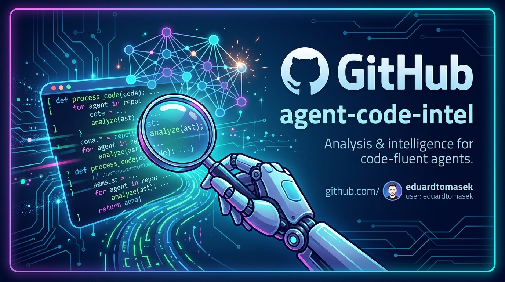

<p align="center">
  
</p>

# Code intelligence for AI agents

This documentation describes installing the whole stack on a Mac. It assumes
only basic familiarity with applications; every required step is explained.

The text matches release 6.1.0.

Once you are done, new projects are set up like this:

```
mkdir ~/projects/my-project
cd ~/projects/my-project
agent-code-intel --agent claude --apply
```

Your AI coding agent can then search the code by meaning, not only by
keywords, and assess the impact of changes.

> `--agent claude` is not there by accident. Without it the script also
> requires Codex and refuses to run if Codex is not installed. If you use both
> agents, you can omit the flag.
>
> You only have to write it once: `--apply` records the choice in the project's
> `.code-intel` file as `AGENTS=claude`, and `--status`, `--refresh` and
> `--remove` then read it on their own. See
> [Which agents the project uses](#which-agents-the-project-uses).

---

## Quick start

This is the shortest path on a new Mac. Run the commands **one at a time** and
move on only after the line with `%` comes back. If Homebrew prints extra
commands for setting up PATH after installation, run those instructions first.

First verify Git:

```
git --version
```

If the command fails, macOS offers to install the developer tools. Finish that
and check Git again:

```
xcode-select --install
git --version
```

Then install Homebrew, Python, containers, local embeddings and Node.js:

```
/bin/bash -c "$(curl -fsSL https://raw.githubusercontent.com/Homebrew/install/HEAD/install.sh)"
brew install python
python3 --version
brew install --cask orbstack
open -a OrbStack
brew install ollama
brew services start ollama
brew install node
```

`gitnexus` is not a Homebrew package and `grepai` installs with its own install
command. Both of them, and the tools for `code-context`, are offered or printed
by `--install-deps` below. After you open OrbStack for the first time, wait for
it to finish setting up, then verify it:

```
docker info
```

Finally, download this project, install its local copy and turn intelligence on
in your first project:

```
git clone https://github.com/eduardtomasek/agent-code-intel.git ~/src/agent-code-intel
cd ~/src/agent-code-intel
python3 ./agent-code-intel --install
agent-code-intel --install-deps
mkdir -p ~/projects/my-project
cd ~/projects/my-project
agent-code-intel --agent both --apply
```

Use `--agent claude` instead of the last command if only Claude should serve
the project, or `--agent codex` if only Codex. `both` sets up both.

## Updating to 6.1.0

An update always starts from the checkout you installed the tool from. Pull the
new source, reinstall the **local file**, and then refresh the managed
artifacts in every project:

```
cd ~/src/agent-code-intel
git pull --ff-only
python3 ./agent-code-intel --install
agent-code-intel --install-deps
cd /path/to/project
agent-code-intel --agent both --apply
```

If you use only one agent, replace the last line with one of these:

```
agent-code-intel --agent claude --apply
agent-code-intel --agent codex --apply
```

`--install` safely updates its own installed copy and keeps your
configuration. `--apply` is idempotent: it leaves an identical routing skill
untouched and otherwise updates only the artifacts of the selected agent.

### What changes incompatibly in version 6

`--apply` writes `.code-intel` in **schema 2**, which additionally contains the
`AGENTS` key — see [Which agents the project uses](#which-agents-the-project-uses).

- **Projects from older versions keep working.** Their `SCHEMA=1` is read and
  `--status` adds a `.code-intel predates AGENTS` line for them, which is **not
  drift**. Running `--apply` is not mandatory; it is only a way to record the
  choice.
- **The other direction does not work.** Once a project has gone through
  `--apply` from version 6, an older version of the tool rejects its
  `.code-intel` with `unsupported SCHEMA=2`. After a downgrade you therefore
  have to run `--apply` from that older version, which rewrites the file back
  to schema 1.

If you keep two different versions of the tool side by side on one machine,
update both, or do not run `--apply` from version 6 in projects served by the
older installation.

---

## Contents

0. [Quick start](#quick-start)
1. [Updating to 6.1.0](#updating-to-610)
2. [What it actually does](#1-what-it-actually-does)
3. [What you will need](#2-what-you-will-need)
4. [The terminal — the basics](#3-the-terminal--the-basics)
5. [Homebrew](#4-homebrew)
6. [OrbStack — containers](#5-orbstack--containers)
7. [Ollama — embedding model](#6-ollama--embedding-model)
8. [Node.js](#7-nodejs)
9. [GrepAI](#8-grepai)
10. [GitNexus](#9-gitnexus)
11. [agent-code-intel](#10-agent-code-intel)
    - [Reference table of all modes and flags](#reference-table-of-all-modes-and-flags)
12. [First project](#11-first-project)
13. [Codex — three gates for an active hook](#codex--three-gates-for-an-active-hook)
14. [Verifying that it works](#12-verifying-that-it-works)
15. [Everyday use](#13-everyday-use)
16. [Dashboard — everything at a glance](#14-dashboard--everything-at-a-glance)
17. [When something goes wrong](#15-when-something-goes-wrong)
18. [Uninstalling](#16-uninstalling)
19. [Glossary](#17-glossary)

---

## 1. What it actually does

When an AI agent works with your code, it first has to find its way around it.
Without help it does that by searching for text strings — like pressing Cmd+F
in an editor. That works as long as you know exactly what to look for. As soon
as you want "find the place where the password is verified", and that function
is called `validateCreds`, text search fails.

This stack adds two things that solve it differently.

**GrepAI** reads your code and turns every piece of it into a set of numbers
that captures meaning — a so-called vector. When you then ask in a sentence,
your question is converted the same way and the pieces of code whose numbers
are closest are found. That is why it finds `validateCreds` even though you
never wrote the word "validate". This is called semantic search.

**GitNexus** builds a map of relationships: what calls what, what depends on
what. It answers questions like "if I change this function, what can break".
That is something you cannot read out of the text itself.

Both run **exclusively on your own computer**. No code leaves the machine.

A single command, `agent-code-intel`, sets all of this up for a new project at
once and at the same time writes instructions for your AI agent about when to
use what.

### What it is made of

| Component            | What it does                            | Why it is needed                         |
| -------------------- | --------------------------------------- | ---------------------------------------- |
| **Ollama**           | Converts text into vectors              | Without it there is nothing to search    |
| **qdrant**           | Vector database, runs in a container    | Stores and searches what ollama produced |
| **OrbStack**         | Runs containers                         | The host for qdrant                      |
| **GrepAI**           | Semantic search                         | Drives indexing and searching            |
| **GitNexus**         | Map of relationships in the code        | Answers "what breaks"                    |
| **Node.js** 24.11+   | Runtime                                 | GitNexus is written in it                |
| **ripgrep (`rg`)**   | Exact search and verification           | Optional tool for the routing skill      |
| **Homebrew**         | Package manager                         | Installs most of the above               |
| **agent-code-intel** | Ties it all together                    | So it is one command, not fifteen        |

Set aside roughly **20 minutes** and **5 GB of disk space**. Most of the time is
waiting for downloads.

---

## 2. What you will need

- A Mac running macOS — the guide is written for both Apple Silicon and Intel
- Since version 5.0.0, Python 3.11 or newer; after installing, verify that
  `python3 --version` prints at least 3.11. Python 3.9 and older ends with a
  readable error and no traceback
- Node.js 24.11.0 or newer — the requirement comes from GitNexus; preflight
  reports a lower version as `warn`, see [chapter 7](#7-nodejs)
- An internet connection
- The password for your Mac account, once, during the Homebrew installation
- Claude Code, VS Code or another agent that speaks MCP

You do not need to know how to program. You do not need to understand what the
individual commands do — each one says what happens and how you can tell it
worked.

### Dependencies in three levels

Since version 5.0.0 the tool distinguishes between what is required for the
product itself, what has a reliable fallback, and what extends the agent's
capabilities:

| Level | Tools | When missing |
| --- | --- | --- |
| **Required** | `git`, `curl`, Python 3.11+, Node.js 24.11+, Docker/OrbStack, Ollama, `grepai`, `gitnexus` | preflight may block the work; `grepai` and `gitnexus` are not in Homebrew |
| **Recommended with a fallback** | `rg`, `ctags` (`universal-ctags`) | preflight prints `warn`; you can use `grep` for searching and the Python stdlib `ast`, or `ast-grep`, for ranges |
| **Strongly recommended** | `ast-grep`, `fd`, `rga`, `tokei`, `scc` | `warn`; the agent only loses structural queries, selection by file properties, reading archives, or overview/complexity |

`--install-deps` checks seven tools from the second and third level plus
`grepai` and `gitnexus`, nine in total: `rg`, `ctags`, `ast-grep`, `fd`,
`rga`, `tokei`, `scc`, `grepai` and `gitnexus`. On macOS it offers
`brew install` for the seven packages available in Homebrew; for `grepai` it
prints its own install command and for `gitnexus` `npm i -g gitnexus`. Without
a TTY it only prints the commands and installs nothing.

Run it after installing this tool:

```
agent-code-intel --install-deps
```

The `--no-install-deps` flag suppresses the Homebrew prompt and installation,
but still prints the check, the missing tools and the commands you can run
manually:

```
agent-code-intel --install-deps --no-install-deps
```

`rg` and `ctags` matter for the documented workflow, but their absence is not a
blocker. In a non-Python language where `ctags` does not return definition
ends, however, without `ast-grep` only the less reliable manual fallback
remains; preflight also warns explicitly when both tools are missing.

---

## 3. The terminal — the basics

The terminal is the application where you type commands to the computer instead
of clicking. You open it like this: press **Cmd + space**, type `Terminal` and
press Enter.

A window appears with a line ending in `%`. You type after it.

Three things that save you trouble:

**Copy commands one at a time.** Copy a line, paste it into the terminal, press
Enter, wait for a new line with `%` to appear. Only then the next one. If you
paste several lines at once and one of them is split, the terminal reports an
error.

**When nothing happens, you are waiting.** Downloads and installations take
time. Until a new line with `%` appears, the command is running. Do not
interrupt it.

**Do not close the terminal** until you are done, so you do not lose context.

Try it. Type:

```
echo hello
```

It has to print `hello`. If it does, you know everything you need.

---

## 4. Homebrew

Homebrew is a package manager — one command installs a program you would
otherwise have to find and download by hand. Most of the next steps use it.

First find out whether you already have it:

```
brew --version
```

If it prints a version number, skip to step 5. If it says `command not found`,
install it:

```
/bin/bash -c "$(curl -fsSL https://raw.githubusercontent.com/Homebrew/install/HEAD/install.sh)"
```

The installer asks for your account password. While you type the password
**nothing is shown** — not even asterisks. That is normal, type it and press
Enter.

At the end Homebrew may print something like "Run these commands in your
terminal to add Homebrew to your PATH" and two or three commands below it.
**Run those commands** — otherwise `brew` will not work. Copy them exactly as
printed.

Check:

```
brew --version
```

It has to print a version. If it still says `command not found`, close the
terminal, open a new one and try again.

---

## 5. OrbStack — containers

A container is an isolated environment in which one program runs. The qdrant
database that the stack needs runs exactly like that — you do not have to
install it into the system, you just start it as a container.

OrbStack is the application that runs containers on a Mac. It is faster and
easier on the battery than Docker Desktop, but if you already have Docker
Desktop, skip this step.

```
brew install --cask orbstack
```

The download is roughly 100 MB. After installing, **start** OrbStack — Cmd +
space, type `OrbStack`, Enter. On first launch it asks you a few things, the
defaults are enough.

In OrbStack settings, enable starting at login. It saves you the daily "why
does this not work" — without a running OrbStack, qdrant has nowhere to run.

Check:

```
docker info > /dev/null 2>&1 && echo "works" || echo "OrbStack not running"
```

It has to say `works`. If not, wait a few seconds for OrbStack to start and try
again.

---

## 6. Ollama — embedding model

Ollama is a program that runs language models on your computer. Here we need it
for one thing only: converting pieces of code into vectors.

```
brew install ollama
```

To make it start automatically at login:

```
brew services start ollama
```

Check:

```
ollama list
```

It prints a table, most likely an empty one. Empty is fine — the point is that
it did not report an error. The model is downloaded later, `agent-code-intel`
pulls it on its own.

---

## 7. Node.js

Node.js is the JavaScript runtime. GitNexus is written in it, so without it you
cannot install it. Check whether you already have it:

```
node --version
```

If it prints a number, move on. If not:

```
brew install node
```

Check:

```
node --version
npm --version
```

Both have to print a version.

### The Node.js version has to be at least 24.11.0

This one is treacherous, because an old version does not show up right away.
GitNexus installs, `gitnexus --version` prints a number without trouble, and it
only falls over during actual indexing.

The requirement comes from GitNexus itself — version 1.6.11 declares
`engines: ^22.18.0 || >=24.11.0`. `agent-code-intel` takes the **upper branch
as a single minimum: 24.11.0**. It is somewhat stricter than what GitNexus
allows, but it is one number instead of two ranges, and no Node on the 22 line
needs explaining.

```
node --version
```

If it prints `v24.11.0` or more, you are fine. Preflight checks it on its own
and prints this for a lower version:

```
  warn      node v20.0.0 is below the 24.11.0 that gitnexus requires
```

If you need to raise the version, first find out where your Node comes from:

```
which node
brew list --versions node
```

Depending on the result you are in one of three situations:

**Node comes from Homebrew** — `brew list --versions node` printed a number:

```
brew upgrade node
```

**Node comes from the installer at nodejs.org** — `which node` points into
`/usr/local/bin`, but `brew list --versions node` printed nothing. This is the
most common case and `brew upgrade node` **fails** in it with
`Error: node not installed`, because Homebrew does not manage that Node.
Install the Homebrew version alongside it:

```
brew install node
```

On Apple Silicon, `/opt/homebrew/bin` comes before `/usr/local/bin` in PATH, so
the new version shadows the old one right away; the original installation stays
untouched. Verify it — `which node` now has to point into `/opt/homebrew`.

**Node comes from nvm** — `which node` points somewhere into `.nvm`:

```
nvm install --lts
nvm use --lts
```

After any change of the Node.js version you **have to reinstall GitNexus**,
because it is bound to the version it was installed under:

```
npm i -g gitnexus
```

---

## 8. GrepAI

GrepAI is the tool that does the semantic search. It installs from the author's
own repository:

```
curl -sSL https://raw.githubusercontent.com/yoanbernabeu/grepai/main/install.sh | sh
```

Instead of that, you can run the installation through
`agent-code-intel --install-deps`, which prints this command if `grepai` is
missing.

Check:

```
grepai version
```

It has to print a version number, for example `grepai version 0.36.1`. Careful,
it is `grepai version`, not `grepai --version` — the second form does not exist
and reports an error.

---

## 9. GitNexus

GitNexus builds that map of relationships in the code.

```
npm i -g gitnexus
```

It prints a few warnings about deprecated packages. That is fine, they are
warnings, not errors.

Check:

```
gitnexus --version
```

It has to print a version.

> **A note for later.** If you ever switch Node.js versions with nvm, GitNexus
> stops working after the switch even though `which gitnexus` still finds it.
> The fix is simple — `npm i -g gitnexus` under the new version. The script
> points it out on its own, because it does not check GitNexus by its existence
> but by actually running it.

### Optional ripgrep (`rg`)

`rg` is fast exact text search. The routing skill picks it when you already
know the exact identifier, configuration key or environment variable, or when
it wants to verify a result after an edit. It is not mandatory for GrepAI and
GitNexus themselves.

```
brew install ripgrep
rg --version
```

---

## 10. agent-code-intel

The tool ties everything above into a single command. Installation requires the
whole repository checkout; the `agent-code-intel` file alone is not enough,
because it loads the `agent_code_intel/` package and the dashboard from the
same checkout.

If you did not use the quick start path, clone the repository and run the
installation from its root:

```
git clone https://github.com/eduardtomasek/agent-code-intel.git ~/src/agent-code-intel
cd ~/src/agent-code-intel
python3 ./agent-code-intel --install
```

The installation stores the launcher in `~/.local/bin/agent-code-intel`, the
importable package in `~/.local/lib/agent-code-intel/` and the dashboard in
`~/.local/bin/code-intel-dash`. If no configuration exists, it creates a
commented `~/.config/code-intel/defaults.toml` template; an existing
`defaults.env` or `defaults.toml` is kept unchanged.

In the default mode it also adds the exact
`Bash(agent-code-intel --refresh)` permission to `~/.claude/settings.json`. The
`--no-perms` flag skips this step; an unreadable settings file is not modified
and the required permission then has to be added by hand.

If the installation prints a warning that `~/.local/bin` is not on PATH, run:

```
echo 'export PATH="$HOME/.local/bin:$PATH"' >> ~/.zshrc
source ~/.zshrc
```

Verify the installation:

```
agent-code-intel --version
```

The command has to print a version number.

### Python 3.11+

Versions 5 and 6 use the active source launcher `agent-code-intel` and the
`agent_code_intel/` package. It requires Python 3.11 or newer. The launcher
does not pick another interpreter automatically and ends with exact
diagnostics on an old version. When installing from the checkout, use the
current `python3`, whose version you can verify with `python3 --version`:

```
python3 ./agent-code-intel --install
```

The installer stores a thin launcher in `~/.local/bin/agent-code-intel`, the
dashboard in `~/.local/bin/code-intel-dash` and the whole importable package in
`~/.local/lib/agent-code-intel/`. The installation copies all Python modules
and the dashboard, does not carry `__pycache__` over, and an upgrade replaces
its own package as a whole. The dashboard version is read from its own
`VERSION`; the CLI version does not override it.

### Flags for dependencies and the hook

`--install-deps` is a standalone mode for checking dependencies and offering to
install them. `--install` installs only the product itself and `--apply` only
checks third-party dependencies — neither of them installs those on its own.

If you manage the hooks in the project yourself, use this during setup:

```
agent-code-intel --agent both --apply --no-hook
```

`--no-hook` skips writing the repo-local `SessionStart` hook. The
`code-context` skill, the routing skill and the rest of the documentation are
not turned off by it.

### Verified languages for exact ranges

Range accuracy has been verified on these real projects:

| Language | What was verified | Recommended approach |
| --- | --- | --- |
| **Python** | `ctags` exact on 10/10 ranges | `ctags` |
| **TypeScript** | `ctags` has no ends for 170 definitions; `ast-grep` 99.4 % | `ast-grep` with a `kind:` rule |
| **PHP / Laravel** | `ctags` has no ends for 145 definitions; `ast-grep` 99.3 % | `ast-grep` with a `kind:` rule |
| **JavaScript** | ranges verified on 236 definitions; wider coverage requires adding `function_expression` and `arrow_function` | check `ctags` first, otherwise `ast-grep` per the skill |
| **Shell** | ranges only; `ctags` found ends for 2/70 definitions | `ast-grep` kind rule; manual fallback when it is missing |

The full verification set for the skill covered Python, TypeScript and PHP;
JavaScript and Shell only have the targeted tests above. Other languages are
not tested. Do not carry a result from one language over to another without
verifying. First find out whether
`ctags --_xformat='%N|%n|%{end}|%K'` returns ends; if it does not and the
language supports `ast-grep`, use the kind rule from the `code-context` skill.
The procedure and the measured data are in the
[code-context measurement plan](docs/plans/code-context-toolchain.md).

### Configuration: `defaults.env` and `defaults.toml`

Two formats are supported, but exactly one of them may exist in a single run:

- `~/.config/code-intel/defaults.env` is executed by a real Bash. It preserves
  expansions, references to previously set values, arrays, exports and output
  on both streams; the supported configuration is passed to subprocesses in an
  immutable environment.
- `~/.config/code-intel/defaults.toml` is a typed file with declared keys. It
  runs neither a shell nor variable expansion. An unknown key, a wrong type or
  unparseable TOML is an error.

When neither file exists, the installation offers a commented TOML template. An
existing ENV file is not converted to TOML automatically and an existing
configuration is not overwritten. If both files exist, the tool exits and asks
you to keep one of them.

### Verifying the active Python launcher

Since the release candidate, the active entry point is the Python launcher. To
verify it by hand, proceed from the checkout like this:

```
python3 ./agent-code-intel --version
python3 ./agent-code-intel --install
hash -r
command -v agent-code-intel
agent-code-intel --version
agent-code-intel --status --json
```

Check that `command -v` points into `~/.local/bin`. An ENV configuration stays
valid; conversion to TOML is always manual and optional.

### Reference table of all modes and flags

You can get the full listing at any time with `agent-code-intel --help`. This
table is its more readable form — for everyday use `--apply`, `--refresh` and
`--status` are enough, the rest are emergency brakes.

#### Modes

The mode is selected by a single flag; without one, a **preview** runs that
changes nothing.

| Mode | What it does |
| --- | --- |
| _(no flag)_ | Preview: prints what would happen and writes nothing |
| `--apply` | Sets the project up, or repairs what has drifted |
| `--refresh` | Reindexes, starts the watchers and checks the state. It creates nothing — without `.code-intel` it fails |
| `--status` | Health check with no writes |
| `--remove` | Takes the tool out of the project (`--remove` alone is a preview, only `--remove --apply` writes) |
| `--install` | Installs the product itself into `~/.local/bin` |
| `--install-deps` | Checks nine tools and on macOS offers `brew install` |
| `--version` | Prints the version |
| `-h`, `--help` | Prints the help |

#### General flags

| Flag | What it does |
| --- | --- |
| `--path DIR` | The project working directory (default: the current one). With `--refresh` it skips looking for the git root |
| `--agent claude\|codex\|both` | Which agents to work for. The default is `AGENTS` from `.code-intel`, and `both` for a project that has not recorded it |
| `[workspace]` | The GrepAI workspace name as the first positional argument (default: the directory name) |

#### What to skip during setup

Applies to the preview and to `--apply`.

| Flag | What it skips |
| --- | --- |
| `--no-bootstrap` | Does not start qdrant or ollama, only checks them |
| `--no-git` | Does not run `git init` and does not touch `.gitignore` |
| `--no-watch` | Does not start the GrepAI watcher |
| `--no-analyze` | Skips the first GitNexus indexing (slow on a large repository) |
| `--no-docs` | Does not touch the agent documents or the routing skill |
| `--no-hook` | Does not write the repo-local `SessionStart` hook |
| `--force-docs` | The opposite: overwrites the managed documents and takes over a foreign routing skill |

#### Per-mode flags

| Flag | Belongs to | What it does |
| --- | --- | --- |
| `--no-grepai` | `--refresh` | Skips the check and the watcher start |
| `--no-gitnexus` | `--refresh` | Skips reindexing |
| `--all` | `--status` | All projects from the registry, not just this one |
| `--json` | `--status` | Machine-readable output instead of a table. It also reports services and starts nothing; this is what the dashboard reads |
| `--purge-collection` | `--remove` | Also deletes the collection in qdrant |
| `--no-perms` | `--install` | Does not touch `~/.claude/settings.json` |
| `--no-install-deps` | `--install-deps` | Does not offer installation through Homebrew, only prints the check |

#### Exit codes

| Mode | 0 | 1 | 2 |
| --- | --- | --- | --- |
| preview | everything matches | error | drifted |
| `--refresh` | fine | could not run (missing dependencies, or the project has no `.code-intel` yet) | ran, but found breakage or a stale index |
| `--status` | fine | error | drifted |
| `--status --json` | **always** | — | — |

`--status --json` returns **zero even on breakage** — deliberately, because it
is called by the dashboard, which reads the state from the JSON, not from the
exit code. So in a script do not rely on the exit code of `--json` and read the
`ok` key.

---

## 11. First project

Now we will try the whole thing on a test project.

```
mkdir -p ~/projects/test-intel
cd ~/projects/test-intel
```

> **Watch out for capital letters.** macOS does not distinguish letter case in
> folders, but it remembers how you typed it. If you write `~/Projects` once and
> `~/projects` the next time, you end up in the same folder, but then you look
> in Finder for something named differently. Stick to one form, ideally
> lowercase.

First have it show you what will happen, without changing anything:

```
agent-code-intel
```

The script first checks whether everything is in place, and while doing that it
starts qdrant and ollama itself if they are not running. The first time it also
downloads the qdrant image and the embedding model, about a gigabyte — it
seems to stall for a while, which is fine.

Then it prints a list of what it would do. All preflight lines should be `ok`.

When everything is green, run it for real:

```
agent-code-intel --apply
```

It goes through nine steps and prints a summary at the end. These files appear
in the folder:

| File                                       | What it is for                                        | Who creates it                        |
| ------------------------------------------ | ----------------------------------------------------- | ------------------------------------- |
| `.git/`                                    | Version control, created automatically                | agent-code-intel                      |
| `.gitignore`                               | So indexes and `.DS_Store` do not get into git        | agent-code-intel                      |
| `.grepai/`                                 | Indexing settings for this project                    | agent-code-intel                      |
| `.mcp.json`                                | Wires the search into your AI agent                   | agent-code-intel                      |
| `CLAUDE.md`                                | Points to the routing and `code-context` skills for Claude | agent-code-intel for `claude`/`both` |
| `.claude/helpers/code-context-hint.py`     | Repo-local Claude and Codex `SessionStart` hint       | agent-code-intel for `claude`/`both`  |
| `.claude/skills/agent-code-intel-routing/` | Decides when to use GrepAI, GitNexus or ripgrep       | agent-code-intel for `claude`/`both`  |
| `.claude/skills/code-context/`             | Exact ranges, references, structure and unreadable formats | agent-code-intel for `claude`/`both` |
| `AGENTS.md`                                | Points to the routing skill for Codex and other agents | agent-code-intel for `codex`/`both`  |
| `.agents/skills/agent-code-intel-routing/` | The same routing skill in the format Codex discovers  | agent-code-intel for `codex`/`both`   |
| `.agents/skills/code-context/`             | The same `code-context` skill for Codex               | agent-code-intel for `codex`/`both`   |
| `.codex/hooks.json`                        | Registers the repo-local Codex `SessionStart` hook    | agent-code-intel for `codex`/`both`   |
| `.gitnexus/`                               | The graph index and its database                      | gitnexus                              |
| `AGENTS.md`, `CLAUDE.md`                   | Its own separate block with graph rules               | gitnexus                              |
| `.claude/skills/gitnexus/`                 | Skills for Claude Code to work with the graph         | gitnexus                              |

`--agent claude`, `--agent codex` and the default `--agent both` drive the MCP
registration, the instruction document and the location of the routing skill at
the same time. During `analyze`, GitNexus may additionally create its own
blocks and Claude skills regardless of this choice; those are not owned by
`agent-code-intel`.

### Which agents the project uses

You do not have to pass the choice every time. `--apply` writes it into the
`.code-intel` file of the given project:

```
# agent-code-intel — identity of this repository. Generated, do not edit by hand.
SCHEMA=2
WORKSPACE=my-project
PROJECT=my-project
AGENTS=claude
```

`--status`, `--refresh` and `--remove` then work with exactly the agents the
project was wired up for. A project set up for Claude only therefore does not
report drift over a missing Codex routing skill, not even in the
`--status --all` listing, where every project has its own answer.

`--agent` on the command line always wins — it is also the way to change the
project's choice:

```
agent-code-intel --agent both --apply      # the project is now served by both agents
```

The listing header says where the value comes from:

```
Agents:    claude (from .code-intel)
Agents:    both (--agent)
Agents:    both (default)
```

Projects wired up by an older version have `SCHEMA=1` with no `AGENTS` key.
They are still read and they work; `--status` adds a `.code-intel predates
AGENTS` line for them, which is not drift — it only points out that the next
`--apply` will record the choice. The other direction does not work: an older
version of the tool refuses to read a file with `SCHEMA=2`.

The locations follow the official documentation for
[Claude Code](https://code.claude.com/docs/en/skills) and
[Codex](https://learn.chatgpt.com/docs/build-skills).

The routing skill is deliberately versionable: `.gitignore` covers `.grepai/`,
`.gitnexus/` and `.DS_Store`, but neither `.claude/` nor `.agents/`. That way
the team gets the same tool decisions. The default GrepAI configuration ignores
both agent folders during indexing.

A repeated `--apply` does not overwrite an identical skill at all. It repairs a
modified managed copy automatically; it safely refuses a foreign skill of the
same name. If you want to take that one over under the tool's management
explicitly, use `--force-docs`. The `--no-docs` flag skips both the documents
and the routing skills.

---

## Codex — three gates for an active hook

> **Important:** the `.codex/hooks.json` file alone does not yet mean Codex runs
> the hook. All three conditions have to be met; if they are not, the hook can
> stay inactive without an error.

With `--agent codex` or `--agent both`, `--apply` writes the registration into
`.codex/hooks.json` and the shared script into
`.claude/helpers/code-context-hint.py`. Then verify in Codex:

1. `~/.codex/config.toml` must not contain `[features] hooks = false`.
2. The project `.codex/` layer has to be trusted.
3. In the CLI, run `/hooks` and approve the project hook.

What you approve is the definition in `hooks.json`, not the text of the script.
If the next `--apply` does not change it, approving once is enough; a change of
the registration requires a new approval. `--status` cannot verify the approval
state, it only reports that `hooks.json` exists.

When the registration is created or changed, `--apply` prints these three
steps. If you manage hooks yourself, skip the write with `--no-hook`.

---

## 12. Verifying that it works

Create a test file. Open the folder in your editor — if you have VS Code with
the `code` command installed, this is enough:

```
code .
```

If `code` reports `command not found`, open the folder in VS Code through
`File → Open Folder`, use another editor, or create the file straight from the
terminal:

```
cat > app.js <<'EOF'
function checkCredentials(user, pass) {
  const hash = hashPassword(pass);
  return db.users.findOne({ name: user, hash });
}
EOF
```

This is what belongs in `app.js`:

```javascript
function checkCredentials(user, pass) {
  const hash = hashPassword(pass);
  return db.users.findOne({ name: user, hash });
}
```

Save it. Then back in the terminal:

```
git add -A
git commit -m "first version"
agent-code-intel --refresh
```

Do commit — it is a good habit and older GitNexus needed it to judge freshness.
Since version 1.6 the condition is gone: `gitnexus status` reports `up-to-date`
even in a repository without a single commit. So if you forget it, nothing
breaks.

The command has to finish with `Code intelligence is fresh.`

### Three checks

**Did the vectors make it into the database?**

```
curl -s http://127.0.0.1:6333/collections/workspace_test-intel | python3 -m json.tool | grep -iE "points|status"
```

You have to see `"status": "green"` and a `points_count` greater than zero.

**Does semantic search work?**

```
grepai search "verifying a user password" --workspace test-intel
```

It has to find `app.js`. Note that the file contains neither the word "verify"
nor "password" — that is why this is the main test. A plain grep would find
nothing.

The `--workspace` flag is mandatory. Without it GrepAI reaches for another,
empty index and returns nonsense.

**Does your AI agent see it?**

Open the folder in your editor and start Claude Code in it. Type `/mcp` — you
have to see both `grepai` and `gitnexus` as connected.

If they are not there, you did not confirm the dialog at startup that asks
whether you trust the project MCP servers. Close Claude Code, open it again and
confirm.

The final test: give the agent a task in which you mention neither the file nor
the function name — for example "find where login credentials are verified in
this project". If it reaches for the `grepai_search` tool, the wiring is
complete.

---

## 13. Everyday use

### A new project

```
mkdir ~/projects/my-project
cd ~/projects/my-project
agent-code-intel --agent claude --apply
```

That is all. The setup you did once applies to all further projects.

### After every code change

```
agent-code-intel --refresh
```

Your AI agent should run this command on its own — it has the instruction for
it in `CLAUDE.md` or `AGENTS.md`, which `agent-code-intel` wrote for it. If it
does not, run it by hand.

Why it is needed at all: GrepAI updates continuously, because a watcher runs in
the background and notices saved files. GitNexus does not — its map is
recomputed only on command, and this command is that command. At the same time
it checks that the watcher is running and reports if something is off. It also
checks the routing skill for the agents selected through `--agent`; a missing
or modified copy of it is drift and the next `--apply` repairs it.

A quick check without reindexing:

```
agent-code-intel --status
```

### Checking all projects at once

```
agent-code-intel --status --all
```

It goes through all the projects you ever set up and says where something is
off. Typically after a Mac restart, when the watcher is not running.

### After restarting the computer

OrbStack and ollama start on their own if you set that up in steps 5 and 6.
**The GrepAI watcher, however, does not start on its own.** Search then keeps
"working", it just answers from stale data, which is worse than an error. The
safeguard is simple — in the project run:

```
agent-code-intel --refresh
```

It starts the watchers and indexes everything that is pending.

---

## 14. Dashboard — everything at a glance

`agent-code-intel --status --all` tells you whether the _setup_ of the projects
is right. What it does not tell you is whether the services underneath are
running and whether they really do what they should — that is deliberate,
because status has to work on a machine where everything is switched off.

The dashboard answers that second question. Start it:

```
code-intel-dash --open
```

A page opens at `http://127.0.0.1:7717`. It runs only on your computer, on the
loopback, without a password — it reaches nowhere. You stop it with Ctrl+C.

Installing from the checkout stores it next to the CLI automatically:

```
python3 ./agent-code-intel --install
```

On every further installation the dashboard's own version is compared; an
identical version is not overwritten, an older or damaged copy is replaced by
the source version.

The dashboard has no checks of its own — it pulls everything about the projects
from `agent-code-intel --status --all --json`. If it had its own checks, sooner
or later they would drift apart from that command and **both would keep showing
green**. That is why it needs `agent-code-intel` on PATH; without it, it says
straight away that it knows nothing.

### What you will see on it

At the top the **stack**, the things common to all projects — one line per
component. On the left the state and the name, on the right values in columns
that line up across all rows, and when something is off, a warning and a fix
below them. Next to the heading there is a summary: `all ok`, or how many
components need attention.

| Row         | What it verifies                                                              |
| ----------- | ----------------------------------------------------------------------------- |
| docker      | the daemon is running, the container is running, it publishes **both** ports 6333 and 6334 |
| qdrant      | HTTP answers, the gRPC port is open, how many collections it has, how fast it answers |
| ollama      | the server is alive, the model is downloaded and loaded, **and it really returns a vector** |
| Node.js     | the version against the 24.11.0 minimum, `registerHooks`, and whether gitnexus starts |
| MCP servers | whether a running `gitnexus mcp` is not older than the index — see below      |

At the bottom every **project** — under its name two buttons (see
[Pausing and retiring a project](#pausing-and-retiring-a-project)) and below
them four tabs. The dashboard interface is in English:

- **Overview** — the watcher, the number of vectors, the size of the graph, the
  age of the index, the configuration. When something is off, the command that
  fixes it is right below.
- **Search** — your own query against the real index. The results can be
  expanded: you see the path, the line range, the similarity score and the
  piece of code itself with line numbers. It is the same search the agent gets.
- **Index contents** — which files actually made it into the index and how much
  of it they take up. **A file that is missing here will never be found by
  search** — this is how you spot a file silently dropping out of the index.
- **Watcher log** — what the watcher has been doing lately, indexing lines in
  green.

The tab is reflected in the address (`#test-intel/search/...`), so you can
bookmark a particular view or pass it on.

### Why this is not just "it lights up green"

The dashboard deliberately does not test only that a process is running — that
is a weak claim. For every component it tries directly the thing it exists for:

- **ollama** gets real text to convert into a vector. When 768 numbers come
  back, embedding is certain to work; a server that answers `/api/tags` while
  being unable to embed would otherwise look healthy.
- **GrepAI** gets a real query. Zero results means an empty index, not a bad
  query.
- **qdrant** shows the number of vectors in the collection. A green collection
  with zero vectors is a broken index, not a healthy one — the dashboard writes
  that in red.
- **GitNexus** reports which Node version the index was built under. When it
  does not match the one running now, it warns you — that is exactly the trap
  from chapter 7.
- **MCP servers** compares when the running `gitnexus mcp` was started with when
  the package was last overwritten. Node loads the code into memory at process
  start, so after `npm i -g gitnexus` every already open agent keeps running the
  old version. A new `analyze` then writes an index that the old server cannot
  read, and in the middle of your work you get `DB version mismatch, v43 index
  vs v42 MCP server`. Nothing on disk is broken — the reader is just older than
  the file. Restarting the client fixes it, and the dashboard tells you which
  one.

When something is wrong, it prints the command that fixes it right away.

### Pausing and retiring a project

On a project you no longer work on, the watcher keeps watching files and the
index keeps consuming CPU and space. Every project therefore has two buttons;
together with **Bring back** and **Stop watcher** on retired projects, they are
the only things on the page that change anything:

- **Pause indexing** stops that project's GrepAI watcher, **Resume indexing**
  starts it again. The index stays as it was; search answers from it, nothing
  new is just added to it. A paused project is **grey** with a
  `watcher paused` label — it is not an error, and `code-intel-dash --once`
  does not return 2 because of it. The pause holds until something else starts
  the watcher again: `agent-code-intel --refresh` (the one the agent runs after
  every code change) or `--apply` starts it and the project is normally green
  again. If the watcher then crashed, the dashboard shows it in red like any
  other error.
- **Remove from code-intel…** asks first, then stops the watcher and removes the
  project from the registry, so it disappears from the dashboard and from
  `agent-code-intel --status --all`. **Nothing is deleted**: `.grepai/`,
  `.gitnexus/`, the collection in qdrant, the routing skills and the block in
  `CLAUDE.md` all stay. You find a retired project at the bottom in the
  *Removed from code-intel* section; **Bring back** returns it to the registry
  with no reindex and with the watcher still paused.

This is not `agent-code-intel --remove`. That one disconnects the project
completely and deletes the index — the right choice when the project should not
use code-intel any more, the wrong one when development merely stopped and you
may come back to it.

The dashboard remembers two things, both next to the configuration
(`~/.config/code-intel/`): `dash-retired` with the list of retired projects and
`dash-paused.json` with the watchers it stopped itself. Writing is possible only
from the dashboard's own page; a foreign website in the browser cannot do it,
even though the server runs without a password.

### Age of the data

The page refreshes itself every 15 seconds. If it stopped, it **turns grey and
says it no longer vouches for anything** — because a dashboard that keeps
showing the last green picture after an outage is worse than none.

### Without a browser

Handy in scripts, cron or a prompt line. It prints JSON and exits with code 0
when healthy, 2 when something is wrong:

```
code-intel-dash --once
```

If port 7717 collided with something else:

```
code-intel-dash --port 8080
```

---

## 15. When something goes wrong

### `command not found`

The program is either not installed, or the system does not know where to look
for it. Go back to the step where it was installed and repeat the check. For
`agent-code-intel` the cause is usually a missing PATH — see the end of step 10.

### `docker run failed` or `Cannot connect to the Docker daemon`

OrbStack is not running. Start it and wait for it to come up:

```
open -a OrbStack
sleep 15
docker info > /dev/null 2>&1 && echo "works" || echo "not yet"
```

Then run `agent-code-intel` again.

### `embedding model ... not pulled` right after a successful download

The server does not know about the model yet. Just run the command again, the
second time it goes through.

### `grepai --version` reports `unknown flag`

The correct form is `grepai version`, without the dashes.

### `does not provide an export named 'registerHooks'`

Your Node.js is too old for what GitNexus needs — the typical symptom of Node
below **24.11.0**. The nasty part is that `gitnexus --version` works — only the
indexing itself breaks. It does not affect GrepAI, semantic search keeps
working in the meantime.

First find out where your Node comes from, because the fix differs accordingly:

```
which node
brew list --versions node
```

Then follow **chapter 7**, the section "The Node.js version has to be at least
24.11.0" — all three cases are described there. Watch out above all for the
most common one: when `which node` points into `/usr/local/bin` and
`brew list --versions node` says nothing, Node came from the installer at
nodejs.org and `brew upgrade node` fails with `Error: node not installed`.
There you use `brew install node`.

After any change of the Node.js version, reinstalling GitNexus is mandatory:

```
npm i -g gitnexus
```

Then, in the project:

```
agent-code-intel --refresh
```

### `workspace ... does not map this project`

The path stored in GrepAI does not match the one the script runs from. Most
often because of capital letters — `~/Projects` versus `~/projects`. Find out
the real form:

```
cd ~/projects/my-project
pwd -P
```

Use the one it printed.

### `.mcp.json` and `CLAUDE.md` are "not" in the folder

You are almost certainly in a different folder than you think. Verify:

```
pwd -P
ls -la
```

In VS Code, open the folder through `File → Open Folder` on the project itself,
not on the parent directory. Or straight from the terminal:

```
cd ~/projects/my-project && code .
```

### The grepai and gitnexus tools are missing in Claude Code

Type `/mcp` and look at what is connected. If they are not there, close Claude
Code and open it again in the project folder — at startup it asks whether you
trust the project MCP servers, and that dialog has to be confirmed.

### Search returns nonsense or nothing

Go through this in order:

1. Is the watcher running? `grepai watch --workspace NAME --status`
2. Are there vectors in the database? See the check in chapter 12.
3. Did you forget `--workspace`? Without it GrepAI searches an empty index.
4. What is the watcher doing? `tail -20 ~/Library/Logs/grepai/grepai-workspace-NAME.log`

### Never edit `.grepai/config.yaml` by hand

The watcher keeps this file in memory and **overwrites it entirely** on every
indexing run. Your edit disappears — with no error, no log record, possibly only
hours later. Configuration changes belong in
`~/.config/code-intel/defaults.toml`, or in an existing
`~/.config/code-intel/defaults.env`; then run `agent-code-intel --apply` again.

---

## 16. Uninstalling

### A single project

In the project folder:

```
agent-code-intel --remove
```

It shows what it would delete. If you agree:

```
agent-code-intel --remove --apply
```

It disconnects the project, stops the watcher, deletes the generated files, cuts
the managed instructions out of `CLAUDE.md` and `AGENTS.md` and removes both
managed copies of the routing skill. A foreign skill of the same name is kept.
It does not touch your code or your git. If you also want to delete the vectors
from the database, add `--purge-collection`.

### The CLI without deleting the configuration

First back up your settings if you want to. Removing the CLI is separate from
the projects, the registry and the shared stack:

```
rm -f ~/.local/bin/agent-code-intel
rm -rf ~/.local/lib/agent-code-intel
```

Do not delete `~/.config/code-intel` if you want to keep the configuration and
the registry for a later installation. Do not delete the whole
`~/.claude/settings.json` file either: if you want to remove the automatic
permission, remove only the exact `Bash(agent-code-intel --refresh)` rule and
keep the other permissions.

### Optionally removing the configuration and the registry

After checking its contents you can remove only this tool's data:

```
rm -rf ~/.config/code-intel
```

This deletes no project resource and no Qdrant data. The projects have to be
disconnected first with `agent-code-intel --remove --apply`; delete the
collection only through a separate, explicit `--purge-collection`.

### The whole stack

```
rm ~/.local/bin/agent-code-intel
rm ~/.local/bin/code-intel-dash
rm -rf ~/.config/code-intel
brew uninstall grepai
npm uninstall -g gitnexus
docker rm -f grepai-qdrant
docker volume rm grepai-qdrant-data
brew services stop ollama
brew uninstall ollama
brew uninstall --cask orbstack
```

Keep Homebrew, Node.js and the downloaded model if you use them for something
else too.

---

## 17. Glossary

**Embedding, vector** — the conversion of text into a set of numbers that
captures meaning. Two texts about the same thing have similar numbers even when
they share no word.

**Semantic search** — searching by meaning instead of by exact text. What GrepAI
does.

**Container** — an isolated environment for one program. You do not have to
install it into the system, you just start it and throw it away again if you
want.

**Image** — the recipe a container is created from. It is downloaded once.

**Watcher** — a program running in the background that watches saved files and
indexes them continuously.

**Index** — a data structure for fast searching. There are two here: the vector
one in GrepAI and the graph one in GitNexus.

**MCP** — the way external tools connect to an AI agent. Thanks to it, Claude
Code can call GrepAI and GitNexus.

**PATH** — the list of folders where the system looks for programs. When a
folder is not in it, you have to run the program by its full path.

**Workspace** — a named group of projects in GrepAI. This stack creates one
workspace per project.

**Preflight** — the check before the start. It finds out what is missing and
prints it all at once.

**Idempotent** — the property of a command you can run several times with the
same result. That is why you can run `agent-code-intel --apply` repeatedly; it
leaves what is done alone and repairs what has broken.
